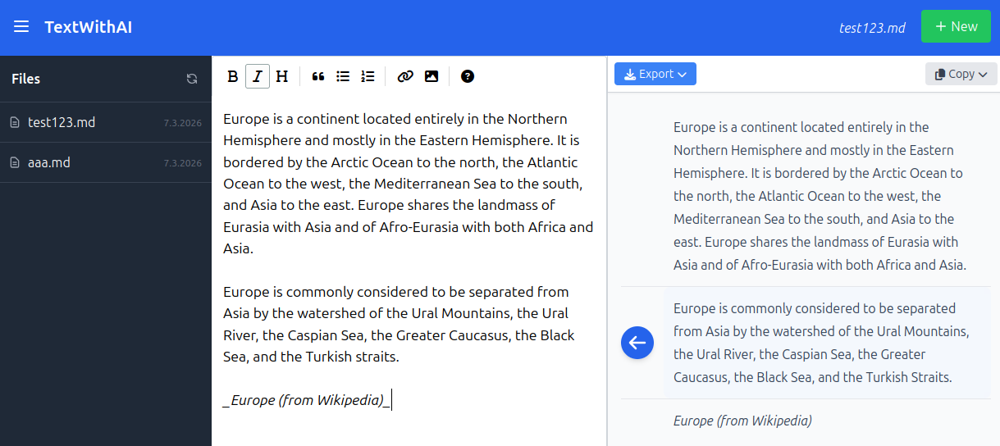

# TextWithAI - AI-Powered Markdown Editor

**TextWithAI** is a lightweight, web-based Markdown editor that uses artificial intelligence to correct, optimize, and support the writing process in real-time. The application is designed to work either locally with **Ollama** or via the **OpenAI API**.

## 🚀 Benefits & Features

- **Real-time AI Assistance:** Correction of spelling, grammar, and style directly within the editor.
- **Seamless Markdown Experience:** Uses the proven EasyMDE editor for a comfortable writing environment.
- **Local or Cloud AI:** Full flexibility between data privacy (local via Ollama) and performance (OpenAI).
- **File Management:** Easily create, save, and load Markdown files in local storage.
- **Version History:** Track corrections and changes within documents.
- **Versatile Export:** Documents can be exported as Markdown (.md), PDF, or plain text (.txt).
- **Simple Installation:** No database required – runs on any PHP-enabled web server.




---

## 🛠 Prerequisites

Before installing TextWithAI, ensure your system meets the following requirements:

1. **Web Server:** Apache or Nginx with PHP support.
2. **PHP:** Version 8.0 or higher.
3. **AI Backend:**
   - **Ollama** (for local execution) – [Ollama Website](https://ollama.com/)
   - **OR** an **OpenAI API Key**.
4. **Write Permissions:** The web server needs write access to the `storage/` directory.

---

## 📦 Installation

1. **Clone or Download the Repository:**
   Download the source code into your web directory (e.g., `/var/www/html/textwithai`).
   ```bash
   git clone https://github.com/YourUsername/textwithai.git .
   ```

2. **Check Directory Structure:**
   Ensure that the `storage` directory exists.
   ```bash
   mkdir -p storage
   ```

3. **Set Permissions:**
   Grant the web server user (e.g., `www-data`) write permissions for the storage folder:
   ```bash
   chmod -R 775 storage
   chown -R www-data:www-data storage
   ```

---

## ⚙️ Setup & Configuration

All configuration is done via the `config.php` file.

1. **Create Configuration File:**
   Copy the example file:
   ```bash
   cp config.example.php config.php
   ```

2. **Adjust the File:**
   Open `config.php` with a text editor of your choice and adjust the values:

   ```php
   <?php
   $config = [
       "llm" => "ollama",           // "ollama" or "openai"
       
       // Ollama Settings (Local)
       "ollama_url"    => "http://localhost:11434",
       "ollama_model"  => "gemma3:12b",
       
       // OpenAI Settings (Cloud)
       "openai_key"    => "sk-proj-...",
       "openai_model"  => "gpt-4o",
       
       "storage"       => __DIR__.'/storage',
       "system_prompt" => "You are a helpful writing assistant. Correct the following text section...",
   ];
   return $config;
   ```

### Key Parameters:
- `llm`: Determines which service is used for AI processing.
- `ollama_url`: The address of your local Ollama server.
- `openai_key`: Your secret API key from OpenAI (only required if `llm` is set to `openai`).
- `system_prompt`: Here you can define how the AI should behave (e.g., language, tone, level of correction).

---

## 📖 Usage

1. Access the application in your browser (e.g., `http://localhost/textwithai`).
2. Create a new file using the **"New"** button at the top right.
3. Select a file from the left sidebar.
4. Write your text in the left editor area.
5. The AI processes your paragraphs automatically (depending on the implementation upon saving or via specific triggers) and displays correction suggestions.
6. Use the **Export** button to download your finished work.

---

## 🔒 Security Notes

- `config.php` contains sensitive data (like API keys) and should never be publicly accessible.
- In the default configuration, the `.gitignore` file prevents uploading `config.php` to Git repositories.
- Ensure that your `storage` folder is protected from direct HTTP access (e.g., via a `.htaccess` file with `Deny from all`).

---

## 📄 License

This project is released under the MIT License. For more information, see the [LICENSE](LICENSE) file (if available).
